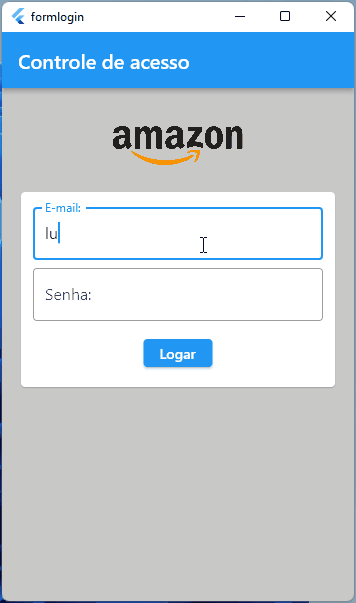

<h1 align="center">LOGIN</h1>

Desenvolvido durante o aprendizado com a Flutterando Master Class.

## Recursos utilizados

- Rotas
- Animação
- Construção do Expassiont Title
- Sobreposição de elementos
- Formulário de login
- Validação de dados de acesso simples (if_else)

### Autor

